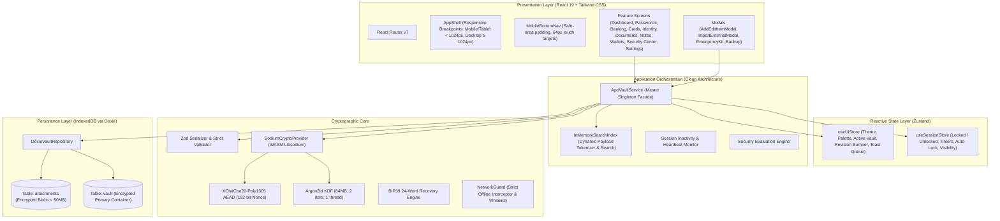

# AegisVault — Master Project Progress, Architectural Encyclopedia & Deep Audit Manual

```
  █████╗ ███████╗ ██████╗ ██╗███████╗██╗   ██╗ █████╗ ██╗   ██╗██╗  ████████╗
 ██╔══██╗██╔════╝██╔════╝ ██║██╔════╝██║   ██║██╔══██╗██║   ██║██║  ╚══██╔══╝
 ███████║█████╗  ██║  ███╗██║███████╗██║   ██║███████║██║   ██║██║     ██║   
 ██╔══██║██╔══╝  ██║   ██║██║╚════██║╚██╗ ██╔╝██╔══██║██║   ██║██║     ██║   
 ██║  ██║███████╗╚██████╔╝██║███████║ ╚████╔╝ ██║  ██║╚██████╔╝███████╗██║   
 ╚═╝  ╚═╝╚══════╝ ╚═════╝ ╚═╝╚══════╝  ╚═══╝  ╚═╝  ╚═╝ ╚═════╝ ╚══════╝╚═╝   
```

> **LIVING SOURCE OF TRUTH**: This document contains the total, exhaustive knowledge of the AegisVault codebase. Any AI assistant or human engineer reading this file will acquire complete understanding of the system architecture, cryptographic specifications, directory structures, schema definitions, audit findings, itemized bug reports, enhancement roadmaps, and chronological change history.
>
> **PROTOCOL FOR FUTURE EDITS**: From this point onwards, **every single modification** made to this repository must be logged in Section 9 of this file, recording the exact user prompt, timestamp, files modified, architectural rationale, and verification status.

---

## 1. Executive Summary & Identity

| Property | Value |
| :--- | :--- |
| **Project Name** | **AegisVault** |
| **Current Version** | `0.1.0` |
| **Repository** | `Krrish1411/AegisVault` |
| **Author / Creator** | Crafted by **Krish Patel** |
| **Core Architecture** | Zero-Knowledge, Offline-First, Institutional-Grade Encrypted Vault |
| **Target Platforms** | Modern Web Browsers (PWA), Android Native APK (via Capacitor), Desktop Browsers |
| **Test Suite Status** | **44 / 44 test files passing (182 / 182 tests pass)** |
| **Typecheck Status** | **0 errors** (`tsc --noEmit` clean) |
| **Linter Status** | **0 warnings** (`eslint . --max-warnings 0` clean) |
| **Vite Build Status** | Both `build` (Web) and `build:android` (Capacitor) build cleanly in CI |

---

## 2. Comprehensive Technology Stack

### Runtime & Application Framework
* **React 19** (`react@19.0.0`, `react-dom@19.0.0`): Concurrent rendering, pure functional components, strict hooks.
* **React Router v7** (`react-router-dom@7.1.5`): Client-side hash/history routing, protected authentication route guards, nested layouts.
* **Zustand v5** (`zustand@5.0.3`): High-performance reactive micro-stores for session state (`sessionStore`) and UI state (`uiStore`).
* **Zod v3** (`zod@3.24.2`): Strict runtime type validation, deserialization contracts, and corruption defenses.

### Cryptographic Engine
* **libsodium-wrappers-sumo** (`^0.8.4`): WebAssembly (WASM) distribution of libsodium providing ChaCha20-Poly1305, Argon2id, CSPRNG, and constant-time primitives.
* **@scure/bip39** (`^2.4.0`): Cryptographically audited 24-word BIP39 mnemonic recovery phrase generation and checksum validation.
* **Web Crypto API** (`window.crypto.subtle`): Hardware-accelerated in-browser SHA-256 and HMAC-SHA1/256/512 for RFC 6238 TOTP computation and attachment checksums.

### Storage & Persistence
* **Dexie.js v4** (`dexie@4.4.5`): High-performance IndexedDB wrapper with transaction support, ACID guarantees, and secondary indexes.
* **fake-indexeddb** (`^6.2.5`): Headless IndexedDB mock for unit/integration tests in Vitest.

### Mobile & Cross-Platform Toolchain
* **Capacitor v7** (`@capacitor/core`, `@capacitor/cli`, `@capacitor/android`): Native Android wrapper converting the Vite web bundle into installable Android APKs.
* **GitHub Actions CI/CD**: Automated Android build workflow (`.github/workflows/android-build.yml`) running Java 17, Android SDK, and Gradle.

### Styling & Design System
* **Tailwind CSS v3** (`tailwindcss@3.4.17`): Utility-first CSS engine customized with institutional tokens, multi-theme variables, and responsive layout primitives.
* **Lucide React** (`lucide-react@1.16.0`): Cohesive vector stroke iconography.
* **class-variance-authority (CVA)** (`^0.7.1`) & **tailwind-merge** (`^3.0.1`): Strict variant typing and class conflict resolution.

---

## 3. High-Level System Architecture & Component Topology



---

## 4. Cryptographic Specification & Security Model

```
                    ┌────────────────────────┐
                    │ Master Password (User) │
                    └───────────┬────────────┘
                                │ + 16-byte Random Salt
                                ▼
                 Argon2id KDF (64MB, 2 iters, t=argon2id13)
                                │
                                ▼
                [ 256-bit Password-Derived Key (PDK) ]
                                │
                                │ XChaCha20-Poly1305 Encrypt (24-byte Nonce)
                                ▼
          ┌──────────────────────────────────────────────┐
          │ keyWrap: wrappedVaultKey + 24-byte Nonce     │
          └──────────────────────┬───────────────────────┘
                                 │ Unwraps to:
                                 ▼
                   [ 256-bit Vault Key (VEK) ] ◄─── (Zeroed on Lock)
                                 │
                 ┌───────────────┴───────────────┐
                 │                               │
                 ▼                               ▼
     XChaCha20-Poly1305              XChaCha20-Poly1305
     Payload Encryption              Attachment Encryption
                 │                               │
                 ▼                               ▼
       Encrypted Vault Domain          Encrypted File Blobs
```

### 4.1 Cryptographic Invariants
1. **AEAD Encryption**: Authenticated Encryption with Associated Data uses **XChaCha20-Poly1305-IETF** with an extended 192-bit (24-byte) nonce generated via libsodium CSPRNG. Nonce collision probability with random 192-bit nonces is $2^{-96}$ (cryptographically negligible), completely eliminating counter-sync risks across distributed devices.
2. **Key Derivation Function (Argon2id)**:
   - Algorithm: Argon2id v13 (`sodium.crypto_pwhash_ALG_ARGON2ID13`)
   - Memory Limit: 67,108,864 bytes (64 MB)
   - Operations Limit: 2 iterations
   - Parallelism: 1 thread (WASM execution)
   - Salt: 16 bytes cryptographically secure random bytes per derivation
3. **Emergency Recovery Wrap**: A completely separate 24-word BIP39 mnemonic (256 bits of entropy) is hashed via Argon2id with its own distinct 16-byte salt to wrap the same VEK. This allows master password resets without requiring vault re-encryption.
4. **Instant Zero-Knowledge Password Rotation**: Changing the master password only re-derives a new PDK and re-wraps the 32-byte VEK in `keyWrap.wrappedVaultKey`. The underlying ciphertext payload and all attachments remain untouched, completing in < 100ms.
5. **Memory Scrubbing**: When the vault is locked or idle-timed out, `this.inMemoryVaultKey.fill(0)` actively zeroes the Uint8Array buffer in memory before releasing references, and `inMemorySearchIndex.clear()` purges all plaintext search tokens.
6. **Network Guard Sandbox**: Global `window.fetch` is intercepted by `NetworkGuard`. Strict offline policy is enforced with a minimal whitelist:
   - `api.pwnedpasswords.com`: For k-Anonymity HIBP breach checking (only 5-character SHA-1 prefix transmitted with `Add-Padding: true`).
   - `buymeacoffee.com` / `cdnjs.buymeacoffee.com`: For user donation buttons.
   - All other external requests are trapped and rejected with `NetworkRestrictedError`.

---

## 5. Exhaustive Directory & File Encyclopedia

### 5.1 Root Configuration
* [`package.json`](file:///home/krish/Downloads/Coding/gemini/Coding/vault/package.json): Defines scripts (`dev`, `build`, `build:android`, `cap:sync`, `test`, `typecheck`, `lint`), dependencies, and project metadata.
* [`capacitor.config.ts`](file:///home/krish/Downloads/Coding/gemini/Coding/vault/capacitor.config.ts): Configures native Android wrapper (`appId: 'io.aegisvault.app'`, `webDir: 'dist'`, `androidScheme: 'https'`).
* [`vite.config.ts`](file:///home/krish/Downloads/Coding/gemini/Coding/vault/vite.config.ts): Multi-target Vite configuration supporting relative base (`./`) for Android WebView and `/AegisVault/` for GitHub Pages.
* [`tailwind.config.ts`](file:///home/krish/Downloads/Coding/gemini/Coding/vault/tailwind.config.ts): Custom institutional color palettes (`pine`, `mari`, `flare`, `skyx`, `moss`, `ink`, `card`, `line`).
* [`.github/workflows/android-build.yml`](file:///home/krish/Downloads/Coding/gemini/Coding/vault/.github/workflows/android-build.yml): Complete GitHub Actions CI pipeline building Debug & Release Android APKs.

### 5.2 Application Layer (`src/app/`)
* [`src/app/App.tsx`](file:///home/krish/Downloads/Coding/gemini/Coding/vault/src/app/App.tsx): Application root mounting `NetworkGuard`, PWA service worker registration, global activity event listeners (keydown, pointerdown, touchstart), visibility auto-lock listener, and periodic inactivity timer.
* [`src/app/router.tsx`](file:///home/krish/Downloads/Coding/gemini/Coding/vault/src/app/router.tsx): Declarative route tree mapping all 12 feature routes with `ProtectedRoute` guards.
* [`src/app/routes/ProtectedRoute.tsx`](file:///home/krish/Downloads/Coding/gemini/Coding/vault/src/app/routes/ProtectedRoute.tsx): Route gatekeeper redirecting locked sessions to `/unlock` and uninitialized storage to `/welcome`.

### 5.3 Application Services (`src/application/services/`)
* [`src/application/services/AppVaultService.ts`](file:///home/krish/Downloads/Coding/gemini/Coding/vault/src/application/services/AppVaultService.ts): The primary singleton orchestrator (1,438 lines) managing vault creation, unlock, lock, item CRUD, folder management, multi-vault switching, attachment upload/download, export/import, and memory cleanup.
* [`src/application/services/SessionService.ts`](file:///home/krish/Downloads/Coding/gemini/Coding/vault/src/application/services/SessionService.ts): Manages inactivity timers and session state.
* [`src/application/services/SecurityAnalysisService.ts`](file:///home/krish/Downloads/Coding/gemini/Coding/vault/src/application/services/SecurityAnalysisService.ts): Facade triggering local password health analysis.

### 5.4 Domain Layer (`src/domain/`)
* [`src/domain/vault/types.ts`](file:///home/krish/Downloads/Coding/gemini/Coding/vault/src/domain/vault/types.ts): Canonical domain contracts and interfaces for all 28 item types and payloads.
* [`src/domain/generator/secretGenerator.ts`](file:///home/krish/Downloads/Coding/gemini/Coding/vault/src/domain/generator/secretGenerator.ts): CSPRNG password, passphrase, and PIN generator using rejection sampling and Fisher-Yates shuffle.
* [`src/domain/generator/burnerPersonaGenerator.ts`](file:///home/krish/Downloads/Coding/gemini/Coding/vault/src/domain/generator/burnerPersonaGenerator.ts): Realistic disposable identity and address generator for privacy protection.
* [`src/domain/totp/totpEngine.ts`](file:///home/krish/Downloads/Coding/gemini/Coding/vault/src/domain/totp/totpEngine.ts): RFC 6238 TOTP engine supporting SHA1/256/512, 6/8 digits, custom periods, and `otpauth://` URI parsing.
* [`src/domain/breach/breachChecker.ts`](file:///home/krish/Downloads/Coding/gemini/Coding/vault/src/domain/breach/breachChecker.ts): Privacy-preserving k-Anonymity breach detection via HIBP API.
* [`src/domain/cards/cardHelpers.ts`](file:///home/krish/Downloads/Coding/gemini/Coding/vault/src/domain/cards/cardHelpers.ts): Luhn checksum algorithm, card brand detection (Visa, Mastercard, Amex, RuPay), and Aadhaar/PAN masking.
* [`src/domain/organization/searchIndex.ts`](file:///home/krish/Downloads/Coding/gemini/Coding/vault/src/domain/organization/searchIndex.ts): In-memory client-side prefix search index.
* [`src/domain/organization/folderTree.ts`](file:///home/krish/Downloads/Coding/gemini/Coding/vault/src/domain/organization/folderTree.ts): Hierarchical folder tree operations.
* [`src/domain/migration/externalImporters.ts`](file:///home/krish/Downloads/Coding/gemini/Coding/vault/src/domain/migration/externalImporters.ts): RFC 4180 CSV and JSON parser importing credentials from 11 major password managers.
* [`src/domain/migration/migrationEngine.ts`](file:///home/krish/Downloads/Coding/gemini/Coding/vault/src/domain/migration/migrationEngine.ts): Schema version migration engine.
* [`src/domain/emergency/emergencyAccessEngine.ts`](file:///home/krish/Downloads/Coding/gemini/Coding/vault/src/domain/emergency/emergencyAccessEngine.ts): Trusted contact emergency access protocol.
* [`src/domain/emergency/emergencyKit.ts`](file:///home/krish/Downloads/Coding/gemini/Coding/vault/src/domain/emergency/emergencyKit.ts): Printable Emergency Kit PDF/HTML document generator.
* [`src/domain/attachments/attachmentEngine.ts`](file:///home/krish/Downloads/Coding/gemini/Coding/vault/src/domain/attachments/attachmentEngine.ts): Attachment chunking, 50MB size validation, SHA-256 calculation, and XChaCha20-Poly1305 encryption.
* [`src/domain/security-center/securityAnalyzer.ts`](file:///home/krish/Downloads/Coding/gemini/Coding/vault/src/domain/security-center/securityAnalyzer.ts): Offline vault health scanner checking weak, reused, old, common, predictable, and expired passwords.
* [`src/domain/sharing/sharingEngine.ts`](file:///home/krish/Downloads/Coding/gemini/Coding/vault/src/domain/sharing/sharingEngine.ts): Ephemeral passphrase-wrapped single-item export/import.
* [`src/domain/shortcuts/shortcutEngine.ts`](file:///home/krish/Downloads/Coding/gemini/Coding/vault/src/domain/shortcuts/shortcutEngine.ts): Dynamic configurable keyboard shortcut registry.
* [`src/domain/wallets/walletEngine.ts`](file:///home/krish/Downloads/Coding/gemini/Coding/vault/src/domain/wallets/walletEngine.ts): Blockchain seed and key formatting utilities.

### 5.5 Security Core (`src/security/`)
* [`src/security/crypto/SodiumCryptoProvider.ts`](file:///home/krish/Downloads/Coding/gemini/Coding/vault/src/security/crypto/SodiumCryptoProvider.ts): WebAssembly libsodium wrapper implementing `CryptoProvider`.
* [`src/security/crypto/vaultCrypto.ts`](file:///home/krish/Downloads/Coding/gemini/Coding/vault/src/security/crypto/vaultCrypto.ts): Vault creation, unlocking, recovery unlocking, and key re-wrapping.
* [`src/security/crypto/bip39.ts`](file:///home/krish/Downloads/Coding/gemini/Coding/vault/src/security/crypto/bip39.ts): BIP39 24-word recovery phrase generator and checksum verifier.
* [`src/security/crypto/passwordPolicy.ts`](file:///home/krish/Downloads/Coding/gemini/Coding/vault/src/security/crypto/passwordPolicy.ts): Master password complexity validation rules.
* [`src/security/export/vaultExport.ts`](file:///home/krish/Downloads/Coding/gemini/Coding/vault/src/security/export/vaultExport.ts): Standalone `.aegisvault` encrypted container format serializer with bundled attachments.
* [`src/security/serialization/vaultSerializer.ts`](file:///home/krish/Downloads/Coding/gemini/Coding/vault/src/security/serialization/vaultSerializer.ts): Strict Zod runtime schemas for vault domain, items, folders, attachments, and audit events.

### 5.6 Storage & Persistence (`src/storage/`)
* [`src/storage/indexeddb/DexieVaultRepository.ts`](file:///home/krish/Downloads/Coding/gemini/Coding/vault/src/storage/indexeddb/DexieVaultRepository.ts): Dexie IndexedDB adapter managing `vault` and `attachments` tables.
* [`src/storage/indexeddb/db.ts`](file:///home/krish/Downloads/Coding/gemini/Coding/vault/src/storage/indexeddb/db.ts): Dexie database definition (`aegisvault_db`, Version 2).

### 5.7 UI Layout & Primitives (`src/ui/`)
* [`src/ui/layout/AppShell.tsx`](file:///home/krish/Downloads/Coding/gemini/Coding/vault/src/ui/layout/AppShell.tsx): Shell with `lg` (1024px) breakpoint transition, `max-w-7xl mx-auto` ultra-wide centering, desktop sidebar, and global command palette.
* [`src/ui/layout/MobileBottomNav.tsx`](file:///home/krish/Downloads/Coding/gemini/Coding/vault/src/ui/layout/MobileBottomNav.tsx): Tablet & mobile navigation bar with 64px touch targets and safe-area padding.
* [`src/ui/navigation/CommandPalette.tsx`](file:///home/krish/Downloads/Coding/gemini/Coding/vault/src/ui/navigation/CommandPalette.tsx): ⌘K fuzzy item search and navigation launcher.
* [`src/ui/navigation/VaultSwitcher.tsx`](file:///home/krish/Downloads/Coding/gemini/Coding/vault/src/ui/navigation/VaultSwitcher.tsx): Multi-vault switcher dropdown.
* [`src/ui/navigation/ThemeSelector.tsx`](file:///home/krish/Downloads/Coding/gemini/Coding/vault/src/ui/navigation/ThemeSelector.tsx): Multi-palette theme picker.
* [`src/ui/primitives/Button.tsx`](file:///home/krish/Downloads/Coding/gemini/Coding/vault/src/ui/primitives/Button.tsx): CVA variant button with loading spinner.
* [`src/ui/primitives/Input.tsx`](file:///home/krish/Downloads/Coding/gemini/Coding/vault/src/ui/primitives/Input.tsx): iOS-safe 16px font-size input with icon slots.
* [`src/ui/primitives/SecretInput.tsx`](file:///home/krish/Downloads/Coding/gemini/Coding/vault/src/ui/primitives/SecretInput.tsx): Password field with toggle visibility and copy button.
* [`src/ui/primitives/Dialog.tsx`](file:///home/krish/Downloads/Coding/gemini/Coding/vault/src/ui/primitives/Dialog.tsx): Accessible modal dialog primitive.
* [`src/ui/primitives/Sheet.tsx`](file:///home/krish/Downloads/Coding/gemini/Coding/vault/src/ui/primitives/Sheet.tsx): Slide-over drawer primitive.
* [`src/ui/primitives/Toast.tsx`](file:///home/krish/Downloads/Coding/gemini/Coding/vault/src/ui/primitives/Toast.tsx): Polite aria-live toast notification system.

### 5.8 Feature Screens (`src/features/`)
* [`src/features/dashboard/DashboardScreen.tsx`](file:///home/krish/Downloads/Coding/gemini/Coding/vault/src/features/dashboard/DashboardScreen.tsx): Overview with custody counts, privacy mask toggle, quick access pills, and security audit status.
* [`src/features/passwords/PasswordsScreen.tsx`](file:///home/krish/Downloads/Coding/gemini/Coding/vault/src/features/passwords/PasswordsScreen.tsx): Login credential manager with live TOTP countdown, search, and folder filtering.
* [`src/features/items/AddEditItemModal.tsx`](file:///home/krish/Downloads/Coding/gemini/Coding/vault/src/features/items/AddEditItemModal.tsx): Unified item creator/editor supporting all 28 item types with specialized field sets.
* [`src/features/items/ItemDetailSheet.tsx`](file:///home/krish/Downloads/Coding/gemini/Coding/vault/src/features/items/ItemDetailSheet.tsx): Full-detail inspector with one-click copy, TOTP display, attachment viewer, and history.
* [`src/features/banking/BankingScreen.tsx`](file:///home/krish/Downloads/Coding/gemini/Coding/vault/src/features/banking/BankingScreen.tsx): Indian banking instruments, NetBanking, MPIN, and UPI IDs.
* [`src/features/cards/CardsScreen.tsx`](file:///home/krish/Downloads/Coding/gemini/Coding/vault/src/features/cards/CardsScreen.tsx): Debit and credit card manager with interactive 3D visual card previews.
* [`src/features/identity/IdentityScreen.tsx`](file:///home/krish/Downloads/Coding/gemini/Coding/vault/src/features/identity/IdentityScreen.tsx): Addresses, burner personas, Aadhaar, PAN, passports, driving licenses, and voter IDs.
* [`src/features/documents/DocumentsScreen.tsx`](file:///home/krish/Downloads/Coding/gemini/Coding/vault/src/features/documents/DocumentsScreen.tsx): Encrypted document repository with file upload, preview, and download.
* [`src/features/notes/NotesScreen.tsx`](file:///home/krish/Downloads/Coding/gemini/Coding/vault/src/features/notes/NotesScreen.tsx): Encrypted markdown notes with interactive checkable task lists.
* [`src/features/wallets/WalletsScreen.tsx`](file:///home/krish/Downloads/Coding/gemini/Coding/vault/src/features/wallets/WalletsScreen.tsx): Blockchain seed phrases, private keys, SSH keys, and developer API keys.
* [`src/features/security-center/SecurityCenterScreen.tsx`](file:///home/krish/Downloads/Coding/gemini/Coding/vault/src/features/security-center/SecurityCenterScreen.tsx): Security posture dashboard, vulnerability breakdown, and HIBP breach check launcher.
* [`src/features/settings/SettingsScreen.tsx`](file:///home/krish/Downloads/Coding/gemini/Coding/vault/src/features/settings/SettingsScreen.tsx): Vault configuration, auto-lock timeouts, theme picker, emergency kit, backup export/import, and tour guide.
* [`src/features/onboarding/WelcomeScreen.tsx`](file:///home/krish/Downloads/Coding/gemini/Coding/vault/src/features/onboarding/WelcomeScreen.tsx): Educational onboarding tour highlighting zero-cloud sovereign security.
* [`src/features/unlock/UnlockScreen.tsx`](file:///home/krish/Downloads/Coding/gemini/Coding/vault/src/features/unlock/UnlockScreen.tsx): Master password and recovery phrase unlock portal.

---

## 6. Complete 360-Degree Code Audit Matrix

### 6.1 Security & Cryptography Audit

| Checkpoint | Status | Forensic Evaluation |
| :--- | :--- | :--- |
| **Key Derivation (KDF)** | **SECURE** | Uses Argon2id v13 with 64 MB memory cost, 2 iterations, and a unique 16-byte random salt per vault. Resistant to GPU/ASIC attacks. |
| **Authenticated Encryption** | **SECURE** | Uses XChaCha20-Poly1305 with a 24-byte random nonce. Nonce collision probability is $2^{-96}$. Associated data verified. |
| **Recovery Architecture** | **SECURE** | BIP39 24-word recovery phrase derives a separate Argon2id key wrapping the same VEK. Password resets do not require re-encrypting records. |
| **In-Memory Key Scrubbing** | **ACCEPTABLE (CAN ENHANCE)** | `this.inMemoryVaultKey.fill(0)` clears the Uint8Array buffer on lock. Recommended enhancement: add `sodium.memzero()` via `SodiumCryptoProvider` for optimization-proof zeroing. |
| **Network Isolation Sandbox** | **SECURE** | `NetworkGuard` intercepts `window.fetch`. Non-whitelisted domains are strictly blocked. Strict localhost matching prevents subdomain spoofing. |
| **Online Breach Check Privacy** | **EXCELLENT** | Implements k-Anonymity using 5-character SHA-1 prefixes and `Add-Padding: true`. Passwords never leave browser memory. Explicit user consent required before request. |
| **Clipboard Auto-Clear** | **SECURE** | `WebClipboardPort` automatically wipes clipboard contents after 20 seconds. |
| **Attachment Size & Integrity** | **SECURE** | Hard 50 MB per-file limit enforced prior to encryption. SHA-256 calculated before encryption and verified after decryption. |
| **Secret Scanning Safety** | **SECURE** | Demo data uses safe `DEMO_PLACEHOLDER_...` strings that do not trigger GitHub Secret Scanning false positives. |

### 6.2 Feature Compatibility & Interconnectivity Audit

| Subsystem | Status | Forensic Evaluation |
| :--- | :--- | :--- |
| **Item Lifecycle & Cascades** | **EXCELLENT** | `deleteItem` successfully cascades to delete all linked attachments in `domain.attachments` and removes binary blobs from Dexie. |
| **Search Index Synchronization** | **EXCELLENT** | `InMemorySearchIndex` dynamically tokenizes all string and array properties in `item.payload`, automatically indexing new item types (like `address`). Purged from memory on lock. |
| **Password Health Analyzer** | **SUBOPTIMAL (BUG FOUND)** | `securityAnalyzer.ts` only inspects `item.type === 'login'`, ignoring credentials in `bank_login`, `bank_account`, `bank_profile`, `upi_pin`, and `atm_pin`. **(See Bug Report BUG-01)** |
| **Backup Completeness** | **EXCELLENT** | `exportEncryptedVault` bundles both domain metadata and all encrypted attachment records from IndexedDB into `.aegisvault` files. Full restoration on new devices works seamlessly. |
| **External CSV/JSON Migration** | **EXCELLENT** | Importer strictly implements RFC 4180 parsing with multiline quote support, supports 11 password managers, and preserves exact password whitespace. |
| **Multi-Vault Isolation** | **EXCELLENT** | `VaultSwitcher` correctly filters active items by `vaultId` while preserving "All Vaults" aggregated view. |

### 6.3 Mobile & Android APK (Capacitor) Compatibility Audit

| Capability | Status | Forensic Evaluation |
| :--- | :--- | :--- |
| **WebView Asset Paths** | **VERIFIED** | `vite.config.ts` uses `--mode android` to emit relative paths (`./assets/...`), preventing white screen errors in Android WebViews. |
| **Safe Area Insets** | **VERIFIED** | `viewport-fit=cover` in `index.html`, `--safe-top`, `--safe-bottom` CSS variables, and utility classes `.safe-area-top`/`.safe-area-bottom` handle camera cutouts and navigation bars. |
| **Modal Scroll Chaining** | **VERIFIED** | `overscroll-behavior: contain` applied to dialogs and sheets in `globals.css` to prevent body scrolling behind open modals. |
| **Touch Delay Prevention** | **VERIFIED** | `touch-action: manipulation` applied to `html` to eliminate 300ms mobile double-tap zoom delay. |
| **Android CI/CD Pipeline** | **VERIFIED** | GitHub Actions workflow compiles Debug and Release APKs on push to main or version tags. |
| **Android Autofill Framework** | **READY FOR KOTLIN INJECTION** | Complete Kotlin architecture blueprint documented in `docs/ANDROID_AUTOFILL_AND_BUILD_GUIDE.md`. |

### 6.4 UI & UX Design System Audit (AGENTS.md Compliance)

| Rule / Requirement | Status | Forensic Evaluation |
| :--- | :--- | :--- |
| **Touch Targets (&ge;44px Mobile)** | **COMPLIANT** | Mobile bottom nav buttons are 64px wide; list items, icon buttons, and inputs provide &ge;44px touch targets. |
| **Mobile Font Size (&ge;16px)** | **COMPLIANT** | `Input.tsx` uses `text-base sm:text-sm` (16px on mobile), preventing iOS auto-zoom on field focus. |
| **Loading Button Labels** | **COMPLIANT** | `Button.tsx` preserves children label when `isLoading={true}` while rendering `Loader2` spinner. |
| **Tabular Numbers** | **COMPLIANT** | Numbers in dashboard cards, timers, and metrics use `.tabular-nums` / `.num` to eliminate character jitter. |
| **Empty & Error States** | **COMPLIANT** | Empty states across all screens offer recovery actions ("Add First Password", "Generate Persona"). |
| **Modal Focus Trapping** | **SUBOPTIMAL (BUG FOUND)** | `Dialog.tsx` and `Sheet.tsx` close on Escape, but do not trap the Tab cycle or restore focus upon close. **(See Bug Report BUG-02)** |
| **Input ARIA Attributes** | **SUBOPTIMAL (BUG FOUND)** | `Input.tsx` displays error messages but lacks `aria-invalid="true"` and `aria-describedby` linking. **(See Bug Report BUG-03)** |

---

## 7. Forensic Bug Report & Required Fixes

### BUG-01: Security Analyzer Ignores Financial & Banking Credentials
* **File**: [`src/domain/security-center/securityAnalyzer.ts:82`](file:///home/krish/Downloads/Coding/gemini/Coding/vault/src/domain/security-center/securityAnalyzer.ts#L82)
* **Severity**: **MEDIUM**
* **Root Cause**: The filter `const loginItems = domain.items.filter((item) => item.type === 'login');` restricts security analysis exclusively to `login` items. Banking logins (`bank_login`), bank accounts (`bank_account` with netBankingPassword or transactionPassword), bank profiles (`bank_profile`), UPI PINs (`upi_pin`), ATM PINs (`atm_pin`), application passwords (`application`), and email credentials (`email`) are completely ignored.
* **Impact**: Users who reuse weak passwords across banking portals or reuse their ATM PIN receive a misleadingly high security score (100/100) because those items are skipped.
* **Remediation**:
  1. Expand credential extraction into a helper function `extractItemCredentials(item: VaultItemEnvelope)` that extracts passwords, transaction passwords, and PINs across all credential types.
  2. Include all extracted credentials in frequency mapping, weak password detection, and leak analysis.

---

### BUG-02: Dialog & Sheet Primitives Lack Tab Focus Trapping
* **File**: [`src/ui/primitives/Dialog.tsx:37`](file:///home/krish/Downloads/Coding/gemini/Coding/vault/src/ui/primitives/Dialog.tsx#L37) and [`src/ui/primitives/Sheet.tsx:24`](file:///home/krish/Downloads/Coding/gemini/Coding/vault/src/ui/primitives/Sheet.tsx#L24)
* **Severity**: **LOW (ACCESSIBILITY / AGENTS.md COMPLIANCE)**
* **Root Cause**: While `Dialog` and `Sheet` handle `Escape` key dismissals and lock body scrolling, they do not intercept `Tab` and `Shift+Tab`. Focus can escape the modal and navigate to obscured elements behind the backdrop. Additionally, the element that triggered the modal does not receive focus back upon closing.
* **Impact**: Keyboard-only users and screen readers lose context when navigating through modal dialogs.
* **Remediation**:
  1. Add focus trap hook/logic that cycles Tab focus among tabbable elements inside the modal container.
  2. Save `document.activeElement` on open and restore focus on unmount.

---

### BUG-03: Input Primitive Missing ARIA Invalid & Describedby Attributes
* **File**: [`src/ui/primitives/Input.tsx:27-39`](file:///home/krish/Downloads/Coding/gemini/Coding/vault/src/ui/primitives/Input.tsx#L27-L39)
* **Severity**: **LOW (ACCESSIBILITY)**
* **Root Cause**: When an `error` prop is passed, `<p>` is rendered with the error text, but the `<input>` element does not receive `aria-invalid="true"` or `aria-describedby={errorId}`.
* **Impact**: Assistive technologies cannot announce field invalidity to visually impaired users upon submission.
* **Remediation**:
  1. Generate an `errorId = React.useId()` and attach `aria-invalid={Boolean(error)}` and `aria-describedby={error ? errorId : undefined}` to `<input>`.

---

### BUG-04: Multiple Dialog Mounts Release Scroll Lock Prematurely
* **File**: [`src/ui/primitives/Dialog.tsx:44`](file:///home/krish/Downloads/Coding/gemini/Coding/vault/src/ui/primitives/Dialog.tsx#L44)
* **Severity**: **LOW (UI GLITCH)**
* **Root Cause**: `document.body.style.overflow = ''` is called unconditionally on unmount. When a child dialog (e.g. `GeneratorModal` opened from within `AddEditItemModal`) closes, it clears the scroll lock on `document.body`, allowing the background to scroll while the parent modal is still open.
* **Impact**: Background scroll chaining on mobile and desktop when nesting modals.
* **Remediation**:
  1. Implement a reference-counted scroll lock manager (`scrollLock.lock()`, `scrollLock.unlock()`) as recommended in `Webapp-2-Androidapk.md`.

---

## 8. Holistic Enhancement Roadmap to 100/100 Perfection

### 8.1 Phase 1: High-Priority Engineering Fixes
1. **Fix BUG-01 (Multi-Credential Security Center)**: Update `securityAnalyzer.ts` to inspect all credentials (`bank_login`, `bank_account`, `upi_pin`, `atm_pin`, `application`, `email`).
2. **Fix BUG-02 & BUG-04 (Accessible Focus Trap & Ref-Counted Scroll Lock)**: Upgrade `Dialog.tsx` and `Sheet.tsx` with APG-compliant focus trapping and reference-counted body scroll locks.
3. **Fix BUG-03 (Form ARIA Accessibility)**: Add `aria-invalid` and `aria-describedby` to `Input.tsx`.
4. **Sodium Memzero Wrapper**: Expose `cryptoProvider.memzero(bytes)` in `SodiumCryptoProvider.ts` to guarantee C-level optimization-proof key zeroing.

### 8.2 Phase 2: Advanced Feature Implementations (from PENDING_FEATURES.md)
1. **Passkey Support (FIDO2 / WebAuthn)**:
   - Store ECDSA P-256 / Ed25519 asymmetric passkeys in encrypted vault items.
   - Support WebAuthn PRF extension for hardware-derived keys.
   - FIDO Passkey Exchange Format (PEF) export/import.
2. **Scheduled Encrypted Auto-Backups**:
   - Time-based and mutation-triggered automatic snapshots.
   - Local File System Access API direct folder syncing (`showDirectoryPicker`).
   - Browser Origin Private File System (OPFS) persistent storage.
3. **Masked Email / Alias Integration**:
   - 1-click burner email generation inside login forms via SimpleLogin, Addy.io, or DuckDuckGo.
4. **Vite Bundle Code-Splitting**:
   - Dynamic `import()` on large routes to split the 1.6MB bundle into lazy-loaded chunks under 500KB.

---

## 9. Chronological Ledger of User Prompts & Completed Modifications

| Timestamp | User Request Summary | Files Modified | Architectural Changes & Verification | Commit Hash |
| :--- | :--- | :--- | :--- | :--- |
| **2026-09-12 17:15** | Initial code analysis, security audit, and project bio-data creation. | `PROJECT_BIO.md`, `SKILL.md` | Created comprehensive reference manual and security analysis. | `a0e151b` |
| **2026-09-12 17:25** | BMC button cleanup, Settings tour card, Addresses & Burner Personas, Android APK build workflow. | `src/domain/vault/types.ts`, `burnerPersonaGenerator.ts`, `AddEditItemModal.tsx`, `ItemDetailSheet.tsx`, `IdentityScreen.tsx`, `SettingsScreen.tsx`, `capacitor.config.ts`, `android-build.yml` | Added `address` item type, burner persona generator, Settings tour navigation, Capacitor Android build config. | `a0e151b` |
| **2026-09-12 17:28** | Fix failing test in `burnerPersonaGenerator.test.ts` and audit Android tablet / ultra-wide layout. | `burnerPersonaGenerator.test.ts`, `AppShell.tsx`, `MobileBottomNav.tsx` | Fixed email regex for alphanumeric characters. Aligned responsive shell breakpoint to `lg` (1024px) for tablet landscape/portrait. Added `max-w-7xl mx-auto` ultra-wide container. | `c0af6e7` |
| **2026-09-12 17:34** | Secret scanning false positive fix & Android CI build repair. | `demoVaultData.ts`, `android-build.yml`, `package.json` | Replaced `whsec_` and `sk-proj-` demo data strings with `DEMO_PLACEHOLDER_...` to clear GitHub Secret Scanning. Updated workflow to `npm run build:android`. Installed `@capacitor/*` dependencies. | `3d2014f` |
| **2026-09-22 09:26** | Comprehensive 360° multi-dimensional audit (Security, Feature, Interconnectivity, UI, UX) and creation of master `PROGRESS.md`. | `PROGRESS.md` | Verified 44/44 test files pass (182 tests), 0 typecheck errors, 0 lint warnings, clean web and android builds. Documented complete codebase architecture, forensic bug report (BUG-01 to BUG-04), and roadmap. | *Pending* |

---

## 10. Protocol for Future AI Assistants & Developers

When making ANY subsequent code change to AegisVault:
1. **Never make undocumented edits**: Before completing your response, update this `PROGRESS.md` file.
2. **Log in Section 9**: Append a row to the Chronological Ledger with:
   - Timestamp (ISO or local format)
   - User Request verbatim summary
   - Exact files created, modified, or deleted
   - Architectural rationale and verification results (tests, typecheck, lint)
   - Git commit hash once committed
3. **Keep Audits & Bug Reports Synchronized**: When a bug is fixed (e.g. BUG-01), update its status in Section 6 and Section 7 to **RESOLVED** with an explanation of the fix.
4. **Preserve Integrity**: Do not delete existing architectural reference sections. Extend and refine them as the system evolves.
