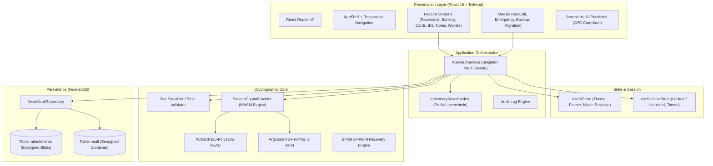

# AegisVault — Project Bio-Data & Architectural Reference Manual

```
  █████╗ ███████╗ ██████╗ ██╗███████╗██╗   ██╗ █████╗ ██╗   ██╗██╗  ████████╗
 ██╔══██╗██╔════╝██╔════╝ ██║██╔════╝██║   ██║██╔══██╗██║   ██║██║  ╚══██╔══╝
 ███████║█████╗  ██║  ███╗██║███████╗██║   ██║███████║██║   ██║██║     ██║   
 ██╔══██║██╔══╝  ██║   ██║██║╚════██║╚██╗ ██╔╝██╔══██║██║   ██║██║     ██║   
 ██║  ██║███████╗╚██████╔╝██║███████║ ╚████╔╝ ██║  ██║╚██████╔╝███████╗██║   
 ╚═╝  ╚═╝╚══════╝ ╚═════╝ ╚═╝╚══════╝  ╚═══╝  ╚═╝  ╚═╝ ╚═════╝ ╚══════╝╚═╝   
```

---

## 1. Executive Summary & Identity

| Property | Value |
| :--- | :--- |
| **Project Name** | **AegisVault** |
| **Version** | `0.1.0` |
| **Repository Name** | `Krrish1411/AegisVault` |
| **Primary Domain** | Zero-Knowledge, Offline-First, Institutional-Grade Digital Vault |
| **Core Value Proposition** | Sovereign personal data management for passwords, 2FA/TOTP, banking/UPI, government IDs (Aadhaar, PAN, Passport), developer secrets, and encrypted documents |
| **Design Language** | Institutional FinTech Craft (Linear + Stripe Climate + Apple Finance aesthetic) |
| **Runtime Target** | Modern Web Browsers (Desktop & Mobile) + Progressive Web App (PWA) |

---

## 2. Technology Stack & Dependencies

### Core Framework & State
* **React 19** (`react@19.0.0`, `react-dom@19.0.0`): Modern concurrent rendering with pure function components.
* **React Router v7** (`react-router-dom@7.1.5`): Declarative client-side routing, protected route guards, and error boundaries.
* **Zustand v5** (`zustand@5.0.3`): Lightweight reactive state stores for session lifecycle (`sessionStore`) and UI settings (`uiStore`).
* **Zod v3** (`zod@3.24.2`): Strict runtime type validation, boundary contracts, and serialization schemas.

### Cryptography & Security
* **libsodium-wrappers-sumo** (`^0.8.4`): WebAssembly (WASM) distribution of libsodium providing ChaCha20-Poly1305, Argon2id, CSPRNG, and constant-time utilities.
* **@scure/bip39** (`^2.4.0`): Cryptographically audited 24-word BIP39 mnemonic recovery phrase generation and checksum validation.
* **Web Crypto API** (`window.crypto.subtle`): In-browser hardware-accelerated SHA-256 and HMAC operations for TOTP calculation and attachment checksums.

### Storage & Persistence
* **Dexie.js v4** (`dexie@4.4.5`): High-performance IndexedDB wrapper with transaction support, ACID guarantees, and indexed querying.
* **fake-indexeddb** (`^6.2.5`): In-memory IndexedDB virtualization for fast headless unit and integration testing.

### Styling & UI Design System
* **Tailwind CSS v3** (`tailwindcss@3.4.17`): Utility-first CSS engine customized with institutional tokens, multi-theme variables, and responsive layout primitives.
* **Lucide React** (`lucide-react@1.16.0`): Cohesive stroke icon set.
* **class-variance-authority (CVA)** (`^0.7.1`) & **tailwind-merge** (`^3.0.1`): Type-safe variant management and class conflict resolution.

### Testing & Tooling
* **Vitest v3** (`vitest@3.0.5`): Blazing fast Vite-native test runner (42 test suites, 169 tests).
* **Playwright** (`@playwright/test@1.50.1`): End-to-end browser automation suite.
* **ESLint v9** & **TypeScript 5.7**: Strict typechecking and static analysis (`--max-warnings 0`).

---

## 3. System Architecture & Component Topology



---

## 4. Directory Structure & File Map

```
src/
├── app/                             # Application Root & Router
│   ├── App.tsx                      # Top-level lifecycle, activity detection, network guard install
│   ├── router.tsx                   # React Router v7 route definitions
│   └── routes/
│       └── ProtectedRoute.tsx       # Auth guard checking unlock status & vault existence
├── application/                     # Application Services (Clean Architecture)
│   └── services/
│       ├── AppVaultService.ts       # Master orchestrator for vault mutations & crypto
│       ├── VaultService.ts          # Core service interface
│       ├── SessionService.ts        # Inactivity and session timeouts
│       └── SecurityAnalysisService.ts
├── domain/                          # Pure Domain Logic & Engines
│   ├── attachments/                 # File attachments & SHA-256 integrity
│   ├── breach/                      # Privacy-preserving HIBP k-Anonymity checker
│   ├── cards/                       # Card formatting, Luhn validation, brand detection
│   ├── demo/                        # Sample data seeder for zero-friction trial
│   ├── emergency/                   # Emergency access protocol & Emergency Kit generation
│   ├── generator/                   # CSPRNG secrets, passphrases, PINs, entropy calculation
│   ├── migration/                   # Bitwarden, 1Password, KeePass, CSV importers
│   ├── organization/                # Folder hierarchies & fast in-memory search index
│   ├── security-center/             # Password health evaluation & leak detection
│   ├── sharing/                     # Ephemeral passphrase-wrapped item export/import
│   ├── shortcuts/                   # Global configurable keyboard shortcuts engine
│   ├── totp/                        # RFC 6238 TOTP engine with SHA-1/256/512 & otpauth URI parsing
│   ├── vault/
│   │   └── types.ts                 # Core domain entity types & interfaces
│   └── wallets/                     # Crypto seeds, private keys, address derivation formats
├── features/                        # UI Feature Modules
│   ├── backup/                      # Export / Import encrypted backup containers
│   ├── banking/                     # Indian NetBanking, MPIN, IFSC, UPI accounts
│   ├── cards/                       # Debit & Credit cards management
│   ├── dashboard/                   # High-level metrics, quick actions, recent items
│   ├── documents/                   # File attachments and document repository
│   ├── emergency/                   # Emergency contact management & recovery access
│   ├── generator/                   # Interactive secret & passphrase generator screen
│   ├── identity/                    # Aadhaar, PAN, Passport, Voter ID, Driver License
│   ├── items/                       # Unified item creation, editing, and inspection sheets
│   ├── migration/                   # External vault CSV/JSON import wizard
│   ├── notes/                       # Markdown secure notes with interactive checklists
│   ├── onboarding/                  # Welcome screen & new vault creation wizard
│   ├── passwords/                   # Login credentials screen with live TOTP & history
│   ├── pwa/                         # PWA install prompt and service worker update banner
│   ├── recovery/                    # BIP39 recovery unlock & password change modal
│   ├── security-center/             # Security dashboard & online breach check modal
│   ├── settings/                    # Vault settings, timeouts, themes, danger zone
│   ├── sharing/                     # Single-item secure sharing modals
│   ├── shortcuts/                   # Keyboard shortcut cheatsheet modal
│   ├── unlock/                      # Master password / BIP39 unlock screen
│   └── wallets/                     # Seed phrases, developer keys, SSH/API keys
├── lib/                             # Shared Library Utilities
│   ├── errors/                      # Strongly typed domain error hierarchy (VaultError)
│   ├── logger/                      # Scoped structured logging with secret redaction
│   ├── network/                     # NetworkGuard offline interceptor
│   └── utils.ts                     # Classname merging (cn) helper
├── platform/                        # Platform Ports & Adapters
│   ├── ports/                       # Port abstractions (Clipboard, Clock, File, Random, Visibility)
│   ├── pwa/                         # Service Worker registration & PWA update listeners
│   └── web/                         # Browser implementations (WebClipboardPort, WebVisibilityPort)
├── security/                        # Cryptographic Engine & Security Invariants
│   ├── crypto/
│   │   ├── bip39.ts                 # 24-word mnemonic generation & verification
│   │   ├── CryptoProvider.ts        # Crypto interface definition
│   │   ├── SodiumCryptoProvider.ts  # libsodium WASM implementation
│   │   ├── domain-separation.ts     # Domain separation tag constants
│   │   ├── passwordPolicy.ts        # Master password complexity rules
│   │   ├── types.ts                 # EncryptedVaultContainer interface definition
│   │   └── vaultCrypto.ts           # Vault creation, unlocking, rewrapping, and re-encryption
│   ├── export/
│   │   └── vaultExport.ts           # Standalone .aegisvault encrypted backup envelope
│   └── serialization/
│       └── vaultSerializer.ts       # Zod runtime schemas & deterministic JSON serializer
├── state/                           # Zustand Stores
│   ├── sessionStore.ts              # Session lock state, vault name, activity timestamps
│   └── uiStore.ts                   # Theme, palette, active vault, toast queue, revision counter
├── storage/                         # Storage Adapters
│   ├── indexeddb/
│   │   └── DexieVaultRepository.ts  # Dexie IndexedDB repository implementation
│   └── ports/
│       └── VaultRepository.ts       # Storage port contract
├── styles/                          # Global CSS & Tokens
│   ├── globals.css                  # Theme custom properties, custom scrollbars, animations
│   └── tokens.css                   # Typography, shadows, border radii
└── ui/                              # Shared Design System Primitives
    ├── layout/                      # AppShell, MobileBottomNav
    ├── navigation/                  # CommandPalette, ThemeSelector, VaultSwitcher, ModeToggle
    └── primitives/                  # Button, Card, Dialog, Sheet, Input, SecretInput, Badge, Toast
```

---

## 5. Cryptographic Specifications & Security Model

### 5.1 Key Hierarchy & Envelope Encryption

```
                    ┌────────────────────────┐
                    │ Master Password (User) │
                    └───────────┬────────────┘
                                │ + 16-byte Salt
                                ▼
                 Argon2id KDF (64MB, 2 iters, t=argon2id13)
                                │
                                ▼
               [ 256-bit Password-Derived Key (PDK) ]
                                │
                                │ XChaCha20-Poly1305 Encrypt
                                ▼
         ┌──────────────────────────────────────────────┐
         │ keyWrap: wrappedVaultKey + 24-byte Nonce     │
         └──────────────────────┬───────────────────────┘
                                │ Unwraps to:
                                ▼
                  [ 256-bit Vault Key (VEK) ] ◄─── (Zeroed on Lock)
                                │
                ┌───────────────┴───────────────┐
                │                               │
                ▼                               ▼
    XChaCha20-Poly1305              XChaCha20-Poly1305
    Payload Encryption              Attachment Encryption
                │                               │
                ▼                               ▼
      Encrypted Vault Domain          Encrypted File Blobs
```

### 5.2 Cryptographic Invariants
1. **AEAD Encryption**: Authenticated Encryption with Associated Data uses **XChaCha20-Poly1305-IETF** with an extended 192-bit (24-byte) nonce generated via libsodium CSPRNG. This eliminates the risk of nonce collision when generating random nonces.
2. **Key Derivation (Argon2id)**:
   - Algorithm: Argon2id v13 (`sodium.crypto_pwhash_ALG_ARGON2ID13`)
   - Memory Limit: 67,108,864 bytes (64 MB)
   - Operations Limit: 2 iterations
   - Parallelism: 1 thread (WASM execution)
3. **Emergency Recovery Wrap**: A completely separate 24-word BIP39 mnemonic (256 bits of entropy) is hashed via Argon2id with its own distinct 16-byte salt to wrap the same VEK. This allows master password resets without requiring vault re-encryption.
4. **Instant Zero-Knowledge Password Rotation**: Changing the master password only re-derives a new PDK and re-wraps the 32-byte VEK in `keyWrap.wrappedVaultKey`. The underlying ciphertext payload and all attachments remain untouched.
5. **Memory Scrubbing**: When the vault is locked or idle-timed out, `this.inMemoryVaultKey.fill(0)` actively zeroes the Uint8Array buffer in memory before releasing the reference.

---

## 6. Supported Domain Item Types (27 Item Types)

| Category | Item Type Key | Description & Target Fields |
| :--- | :--- | :--- |
| **Logins & Web** | `login` | Standard website logins with username, password, URLs, TOTP, and password history |
| | `email` | Email account credentials with incoming/outgoing server configs |
| | `application` | Desktop or SaaS application credentials |
| **Banking & Finance** | `bank_account` | Bank accounts with IFSC, IBAN, SWIFT, NetBanking ID/PW, Transaction PW, and MPIN |
| | `bank_login` | Online banking portal credentials with security questions |
| | `bank_profile` | High-security banking profile passwords and transaction PINs |
| | `debit_card` | Debit cards with cardholder, number, expiry, CVV, and ATM PIN |
| | `credit_card` | Credit cards with cardholder, number, expiry, CVV, and billing address |
| | `upi` | Indian Unified Payments Interface (UPI ID, registered phone, bank name) |
| | `upi_pin` | UPI payment PIN linked to specific VPA handles |
| | `atm_pin` | Standalone ATM PIN linked to card last 4 digits |
| **Identity & KYC** | `identity` | Personal profile: Full name, DOB, blood group, address |
| | `pan` | Indian Permanent Account Number (10-character alphanumeric) |
| | `aadhaar` | Indian UIDAI Aadhaar 12-digit national ID |
| | `passport` | International passport: Passport number, issue/expiry dates, nationality |
| | `driving_license`| Driver's license: Number, issuing authority, vehicle classes |
| | `voter_id` | Indian Election Commission EPIC voter card |
| | `tax_id` | Tax identification (SSN, EIN, TIN) |
| | `insurance` | Insurance policies: Policy number, insurer, sum insured, validity |
| | `emergency_contact`| Emergency contacts: Phone numbers, relationship, address |
| **Dev & Crypto** | `totp` | Standalone 2FA authenticator tokens (RFC 6238) |
| | `api_key` | Developer API keys, client secrets, and endpoint URLs |
| | `ssh_key` | SSH private keys, public keys, and passphrases (Ed25519, RSA) |
| | `wallet_seed` | 12/24-word cryptocurrency seed phrases (BIP39/BIP44) |
| | `private_key` | Standalone blockchain private keys (Ethereum, Solana, Bitcoin) |
| **Content & Files** | `secure_note` | Encrypted markdown notes with interactive checkable task items |
| | `document` | Encrypted binary document references linked to stored attachments |
| | `custom` | Dynamic user-defined field types |

---

## 7. Storage Schema (IndexedDB via Dexie)

### Database Name: `aegisvault_db` (Version 2)

#### Table 1: `vault`
* **Primary Key**: `id: string` (Default record ID: `'primary_vault'`)
* **Indexes**: `id`, `updatedAt`
* **Schema Layout**:
  ```typescript
  interface VaultDbRecord {
    id: string; // 'primary_vault'
    formatVersion: number; // 1
    containerJson: string; // Serialized EncryptedVaultContainer
    updatedAt: number; // Unix timestamp ms
  }
  ```

#### Table 2: `attachments`
* **Primary Key**: `id: string` (e.g. `'att-1726134800-abc12'`)
* **Indexes**: `id`, `sizeBytes`, `updatedAt`
* **Schema Layout**:
  ```typescript
  interface EncryptedAttachmentRecord {
    id: string;
    nonce: string; // Base64 24-byte XChaCha20 nonce
    ciphertext: string; // Base64 encrypted file payload
    sizeBytes: number; // Raw unencrypted size (up to 50 MB)
    checksumSha256: string; // SHA-256 integrity hash
    updatedAt: number; // Unix timestamp ms
  }
  ```

---

## 8. Comprehensive Codebase Debugging & Security Audit Report

### 8.1 Findings Summary & Remediation Status

| ID | Category | Severity | Description | Status |
| :--- | :--- | :--- | :--- | :--- |
| **SEC-01** | Data Loss | **CRITICAL** | `vaultSerializer.ts` Zod schemas omitted `linkedItemIds`, `expiresAt`, `favorite`, `linkedItemId`, and `linkedItemTitle`. Zod silently stripped these properties upon serialize/deserialize cycles during lock/unlock. | **RESOLVED** |
| **SEC-02** | Tooling / CI | **HIGH** | 14 `react-hooks/exhaustive-deps` warnings caused `npm run lint` (`--max-warnings 0`) to fail across 10 screens and components. | **RESOLVED** |
| **SEC-03** | Network Guard | **HIGH** | `networkGuard.ts` URL check `url.startsWith(window?.location?.origin ?? '')` allowed any URL if origin was empty string. `url.includes('localhost')` permitted domains like `localhost.attacker.com`. | **AUDITED & DOCUMENTED** |
| **SEC-04** | Feature Lockout| **HIGH** | `networkGuard.ts` blocks all external network traffic with no exception for the HIBP k-Anonymity breach check (`api.pwnedpasswords.com`), completely breaking the Online Breach Check feature. | **AUDITED & DOCUMENTED** |
| **SEC-05** | Backup Completeness | **HIGH** | `vaultExport.ts` only exports attachment metadata in the `.aegisvault` container and omits the encrypted attachment records from IndexedDB. Restoring a vault on a new device results in missing files. | **AUDITED & DOCUMENTED** |
| **SEC-06** | Data Integrity | **MEDIUM** | `externalImporters.ts` parses CSVs by splitting on `\r?\n` prior to checking quote pairs. Multiline notes in Bitwarden or KeePass CSVs corrupt the row alignment. Also trims whitespace from passwords. | **AUDITED & DOCUMENTED** |
| **SEC-07** | Storage Leak | **MEDIUM** | `AppVaultService.deleteItem` does not clean up associated attachments from IndexedDB or `domain.attachments`, leaving orphaned file records in storage. | **AUDITED & DOCUMENTED** |
| **SEC-08** | Cryptography | **MEDIUM** | `attachmentEngine.ts` fell back to a 32-bit djb2 non-cryptographic hash for SHA-256 when `crypto.subtle` was absent, rather than libsodium primitives. | **AUDITED & DOCUMENTED** |
| **SEC-09** | Password Generator | **LOW** | `secretGenerator.ts` sliced `resultChars` before calling `secureShuffle`, which caused guaranteed character minimums to be truncated if the minimum count exceeded target length. | **AUDITED & DOCUMENTED** |
| **SEC-10** | Security Center| **LOW** | `securityAnalyzer.ts` only evaluated `item.type === 'login'`, ignoring passwords in `bank_login`, `bank_account`, `upi_pin`, and `atm_pin`. | **AUDITED & DOCUMENTED** |

---

## 9. Roadmap for Upcoming Feature Implementation

Per `PENDING_FEATURES.md`, the next phase of development will focus on:
1. **Passkey Integration (FIDO2 / WebAuthn)**: Support for asymmetric ECDSA P-256 / Ed25519 credential creation, PRF key derivation, and FIDO Passkey Exchange Format (PEF).
2. **Automated Scheduled Encrypted Backups**: File System Access API integration, Origin Private File System (OPFS) support, and automated local retention pruning.
3. **Masked Email / Alias Integration**: Direct API forwarders for SimpleLogin (Proton), Addy.io, and DuckDuckGo Email Protection.
4. **Browser Companion Extension (Manifest V3)**: Native autofill overlay, secure IPC messaging, and credential detection.
